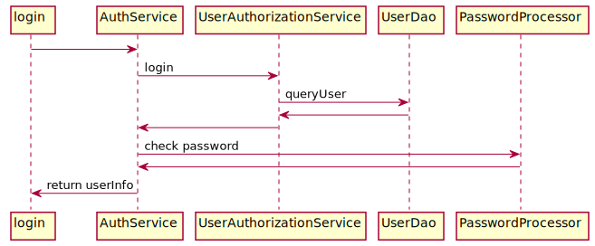

# 项目说明

基于 Spring Boot 的 Java Web Server 框架, 简化开发 。


通过`maven`引入:

```
<dependency>
  <groupId>net.cofcool.chaos</groupId>
  <artifactId>chaos-server-${MODULE_NAME}</artifactId>
  <version>0.3.2</version>
</dependency>
```

### 命令示例

运行模式：

* dev
* test
* release

打包:

```sh
# release打包
mvn clean -Prelease install
```

运行：
```sh
java -jar chaos-server.jar > chaos-server.log 2>&1 &
```

关闭应用程序(grep查询的关键词视运行命令而定)：

```sh
#!/bin/bash
pid=`jps -l | grep chaos-server.jar | awk '{ print $1 }'`
echo $pid
if [ -n "$pid" ];then
        kill -9 $pid
fi
```

### 模块说明

第三方依赖:

1. Spring Boot
2. Spring data Jpa
3. MyBatis
4. Mybatis-PageHelper
5. Jackson
7. Shiro
8. Spring Security
9. Spring data Redis
10. Ehcache
10. ...


项目模块:

1. common
2. core
3. data-jpa
4. data-mybatis
5. data-redis
6. security-shiro
7. security-spring
8. actuator
9. component-processor
10. boot-starter

### 配置 


```properties
# 项目运行模式
chaos.development.mode=dev
# 项目版本
chaos.development.version=100
# 是否开启验证码
chaos.auth.using-captcha=false
# 定义扫描 Scanned 注解的路径
chaos.development.annotation-path=net.cofcool.chaos.server.demo
# shiro授权路径配置
chaos.auth.urls=/auth/**\=anon\n/error\=anon\n/**\=authc
# 登陆路径
chaos.auth.login-url=/auth/login
# 注入数据key配置, 多个时以","分隔
chaos.auth.checked-keys=id
```

### 使用

业务相关Service可继承`DataAccess`接口, 实现类可继承`SimpleService`抽象类。


使用`Page`类封装分页的相关数据, ORM模块的`Paging`继承并扩展。

* Mybatis: 通过`PageHelper`分页。
* Jpa: 通过`Pageable`分页。

**异常**处理时, 自定义业务相关异常需继承`ServiceException`。如需设定异常级别, 实现`ExceptionLevel`接口即可, 该级别影响异常的打印。`ServiceException`已实现该接口, 默认为最高级别。

#### 授权处理

封装了`Apache Shiro`和`Spring Security`, 应用可依赖`security-shiro`模块或`security-spring`模块来实现授权管理("security-spring"还未完成)。

登录:



`AuthService`类定义了登录等操作, 应用不需要实现该类, 只需引用该组件即可。

```java
public interface AuthService<T extends Auth, ID extends Serializable> {

    /**
     * 登陆
     * @param loginUser 登陆时携带的参数
     * @return 登陆数据
     */
    Message<User<T, ID>> login(AbstractLogin loginUser);

    /**
     * 退出登陆
     */
    void logout(HttpServletRequest httpServletRequest, HttpServletResponse httpServletResponse);

    /**
     * 读取当前登陆用户数据
     * @return {@link User}
     */
    @Nullable
    User<T, ID> readCurrentUser();

}
```

`UserAuthorizationService`定义应用操作, 应用需实现该类。

```java
public interface UserAuthorizationService<T extends Auth, ID extends Serializable> {

    /**
     * 查询登陆用户
     * @param loginUser 登陆参数
     * @return 查询结果
     */
    User<T, ID> queryUser(AbstractLogin loginUser);

    /**
     * 检查用户, 登陆时调用
     * @param currentUser 当前用户
     * @return {@link Message}
     */
    Message<Boolean> checkUser(User<T, ID> currentUser);

    /**
     * 配置登陆时的用户数据
     * @param currentUser 当前用户
     */
    void setupUserData(User<T, ID> currentUser);

    /**
     * 检查权限
     * @param servletRequest 请求
     * @param servletResponse 响应
     * @return 是否通过验证
     */
    boolean checkPermission(ServletRequest servletRequest, ServletResponse servletResponse);

    /**
     * 配置用户数据处理器
     *
     * @param userProcessor 用户数据处理器
     */
    default void setUserProcessor(UserProcessor userProcessor) {

    }

    /**
     * 报告授权验证异常信息
     * @param authenticationInfo 授权信息
     * @param authenticationException 异常信息
     */
    default void reportAuthenticationExceptionInfo(Object authenticationInfo, Throwable authenticationException) {

    }

}
```

默认提供三种"Controller(使用`Scanned`注解)"代理类:

* 注入用户数据到请求参数中, 即数据隔离，实现类为`ApiProcessingInterceptor`
* 请求日志打印，实现类为`LoggingInterceptor`
* 参数校验，实现类为`ValidateInterceptor`

#### Service 层

`DataAccess`定义"Service"常用的方法。

```java
public interface DataAccess<T> {

    /**
     * 添加
     *
     * @param entity 实体
     *
     * @return {@link ExecuteResult} 对象
     */
    ExecuteResult<T> add(T entity);

    /**
     * 删除
     *
     * @param entity 实体
     *
     * @return 执行状态
     */
    ResultState delete(T entity);

    /**
     * 修改
     *
     * @param entity 实体
     *
     * @return {@link ExecuteResult} 对象
     */
    ExecuteResult<T> update(T entity);

    /**
     * 分页查询
     *
     * @param condition 条件
     * @param entity 实体
     *
     * @return {@link QueryResult} 对象
     */
    QueryResult <T, ?> query(Page<T> condition, T entity);

    /**
     * 查询所有
     *
     * @param entity 实体
     *
     * @return {@link ExecuteResult} 对象
     */
    ExecuteResult<List<T>> queryAll(T entity);

    /**
     * 查询详情
     *
     * @param entity 实体
     *
     * @return {@link ExecuteResult} 对象
     */
    ExecuteResult<T> queryById(T entity);

}

```

`Result`封装运行结果，提供两个之接口，`QueryResult`封装查询结果，其它情况由`ExecuteResult`处理。

```java
public interface Result<T> extends Serializable {

    /**
     * 执行状态
     */
    enum ResultState {
        /**
         * 成功
         */
        SUCCESSFUL,
        /**
         * 失败
         */
        FAILURE,
        /**
         * 等待中
         */
        WAITING,
        /**
         * 未知
         */
        UNKNOWN
    }


    /**
     * 结果数据
     *
     * @return 封装的Message对象
     *
     * @see Message
     */
    Message<T> getResult();

    /**
     * 执行是否成功
     * @return 执行是否成功
     */
    default boolean successful() {
        return true;
    }

}
```

抽象类`SimpleService`实现`DataAccess`类，实现`query`方法，简化分页操作，定义`queryWithPage`方法，用于分页查询。通过`ExceptionCodeManager`描述执行状态错误码等。JPA 应用的"Service"可继承`SimpleJpaService`。

#### Dao 层


#### 异常处理

`GlobalHandlerExceptionResolver`处理在请求中发生的异常，包括如下异常:

* ServiceException
* NullPointerException || IndexOutOfBoundsException || NoSuchElementException
* HttpMessageNotReadableException
* UnsupportedOperationException
* MethodArgumentNotValidException
* DataAccessException
